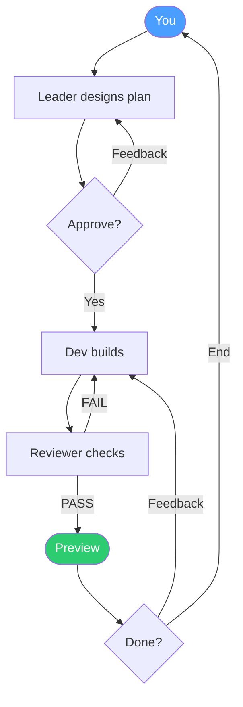

# Team Workflow

Three loops keep things moving:
- **Design loop** — Leader proposes a plan, you refine it until you're happy, then approve
- **Review loop** — Reviewer catches bugs or missing features, Dev fixes (up to 3 cycles)
- **Feedback loop** — You preview the result and request changes, or end the project and start fresh

The leader acts as Creative Director — designing the product vision (theme, style, user experience), not just listing technical tasks. After you approve, the team executes autonomously with built-in review cycles and budget safeguards.
